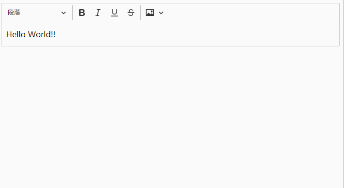

# Nuxtjs integrate CKEditor5 (Typescript)

## Demo
Custom editor-classic from source and import image resize plugin.

## Environment
- Node v14.17.5
- Npm 6.14.14
- Nuxtjs 2.15.7

## Troubleshooting

### window is not defined
If you set `ssr: true` in the `nuxt.config.js` and put your custom `VCKEditor.vue` into the components folder, the Nuxt will scan the components folder by Server Side and 
it doesn't know the `window` keyword which is the JavaScript object in `@ckeditor/ckeditor5-vue2`.

**There are two solutions, just choose one**
-  set `components: false` in the `nuxt.config.js`. 
-  Move the `CKEditor.vue` to components folder outside.

Finally, register `CKEditor.vue` as plugins and set plugins `ssr: false` in the `nuxt.config.js`.
 
### Cannot read property 'getAttribute' of null
You need exclude `@ckeditor` in the svg and load it with raw-loader.

### CKEditor5 CSS disappear
You need to set the `postcss` in the `nuxt.config.js`.

### ERROR  [CKEditorWebpackPlugin] Error: No translation has been found for the xx language.
This error will trigger by setting `ssr: true` in the `nuxt.config.js` and it doesn't affect the building.
 
You can find the 300th line in the `_getTranslationAssets` method in the source code `node_modules\@ckeditor\ckeditor5-dev-utils\lib\translations\multiplelanguagetranslationservice.js`. It will trigger an error message but does not affect the operation.

## Switch Version
- [Javascript](https://github.com/changemyminds/nuxtjs-integrate-ckeditor5/tree/master)
- [Typescript](https://github.com/changemyminds/nuxtjs-integrate-ckeditor5/tree/typescript)

## Reference
- https://ckeditor.com/docs/ckeditor5/latest/builds/guides/integration/frameworks/vuejs-v2.html
- https://github.com/ckeditor/ckeditor5/issues/6071#issue-549499696